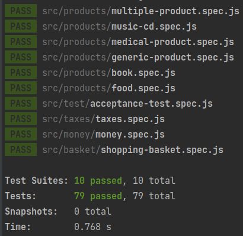

# REVIVA Tech Assignment

## Engine requirements

The solution is tested against the following node versions:

* node v14.19.3
* npm 6.14.17

## Solution

The provided solution has been implemented in TDD. The correctness of the problem is guaranteed by the test suite; in
particular the spec [acceptance-test.spec.js](src/test/acceptance-test.spec.js) uses inputs & outputs of the given
problem.

For the input format, I chose json, for avoiding manual parsing. Inputs can be found in the following locations:

* [src/test/fixtures/input-1.json](src/test/fixtures/input-1.json)
* [src/test/fixtures/input-2.json](src/test/fixtures/input-2.json)
* [src/test/fixtures/input-3.json](src/test/fixtures/input-3.json)

For the outputs, I used the same output of the given problem. Outputs are:

* [src/test/fixtures/output-1.txt](src/test/fixtures/output-1.txt)
* [src/test/fixtures/output-2.txt](src/test/fixtures/output-2.txt)
* [src/test/fixtures/output-3.txt](src/test/fixtures/output-3.txt)

## Compile & Running

Let's start by installing external packages:

    npm install

Then you can run the provided test suite:

    npm run test

## Test suite

The test framework used is [jest](https://jestjs.io/).

### Note on Jest

I used the experimental flag `--experimental-vm-modules` because apparently jest does not support by default [ES6
Modules](https://hacks.mozilla.org/2015/08/es6-in-depth-modules/).
